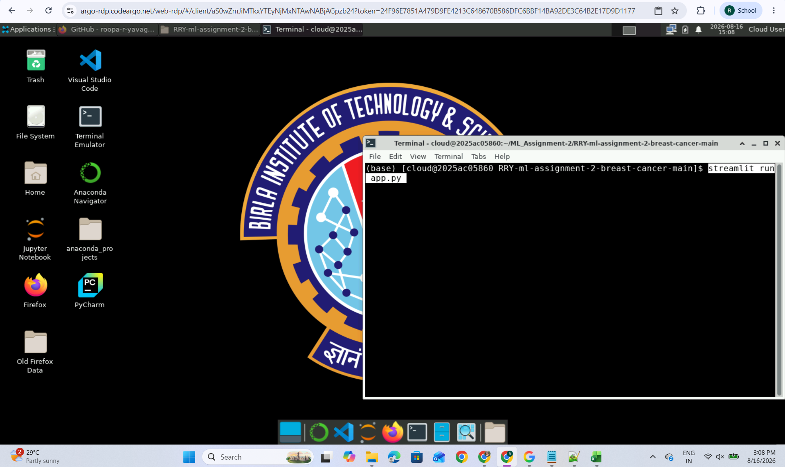
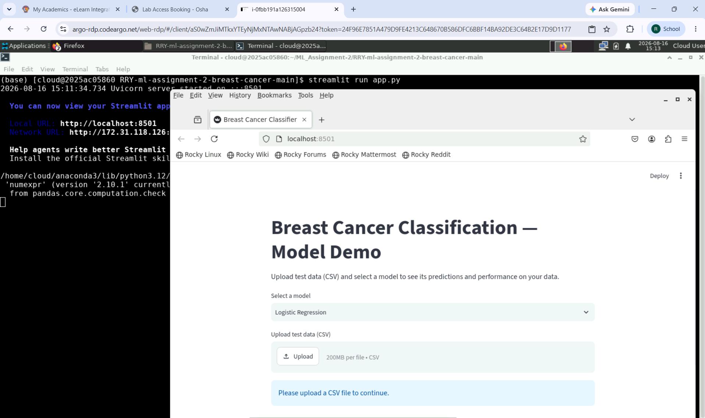
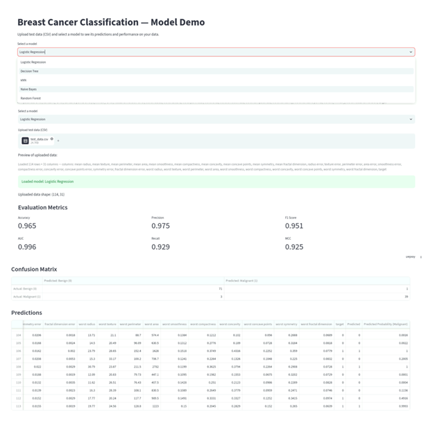
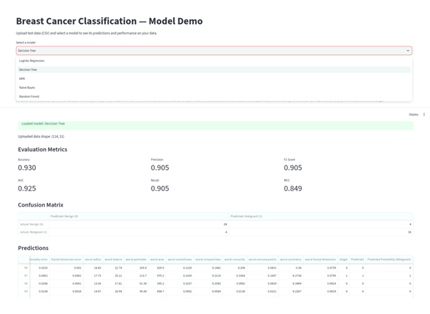
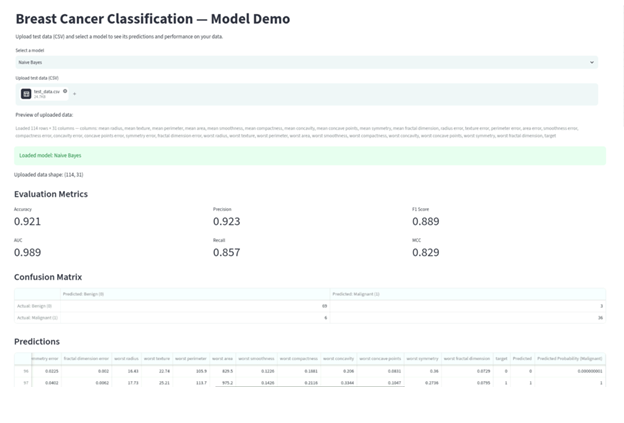
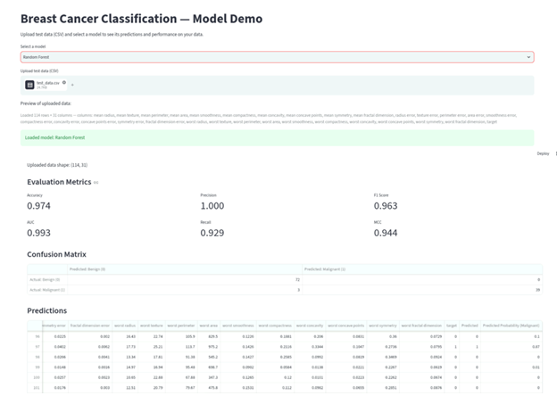

# RRY-ml-assignment-2-breast-cancer
This asssignment is to implement multiple classification models and evaluate the performance of the models for the breast cancer dataset, Build an interactive Streamlit web application to demonstrate your models
# Breast Cancer Classification — ML Assignment 2

## a. Problem Statement

The goal of this project is to build and compare multiple binary classification
models that predict whether a breast tumor is **malignant** or **benign** based on
digitized measurements from a fine needle aspirate (FNA) of a breast mass. This is
a diagnostic support task: correctly identifying malignant cases (recall) carries
particular clinical importance, since a missed malignant diagnosis (false negative)
is generally more costly than a false alarm (false positive).

## b. Dataset Description

- **Source**: Breast Cancer Wisconsin (Diagnostic) dataset, available via
  `sklearn.datasets.load_breast_cancer()` (originally from the UCI Machine
  Learning Repository).
- **Instances**: 569
- **Features**: 30 numeric features, computed from digitized images of FNA
  samples — describing characteristics of cell nuclei such as radius, texture,
  perimeter, area, smoothness, compactness, concavity, symmetry, and fractal
  dimension (each reported as mean, standard error, and "worst"/largest value).
- **Target**: Binary — malignant vs. benign.
  - **Note on label direction**: scikit-learn's default encoding maps
    0 = malignant, 1 = benign. For this project, labels were **flipped** so that
    **1 = malignant (positive class)** and **0 = benign (negative class)**,
    aligning with the conventional framing where the "positive" class is the
    condition of clinical interest. All precision/recall/F1/MCC figures below
    are computed with respect to this flipped encoding.
- **Class balance**: 212 malignant (37.3%) / 357 benign (62.7%) — a mild but
  real imbalance, which is part of why MCC (in addition to accuracy) is reported
  for each model.
- **Missing values**: none.
- **Train/test split**: 80/20, stratified on the target to preserve class
  balance in both sets (random_state=42 for reproducibility).

## c. GitHub Repository Link

[https://github.com/roopa-r-yavagal/RRY-ml-assignment-2-breast-cancer](https://github.com/roopa-r-yavagal/RRY-ml-assignment-2-breast-cancer)

## d. Models Used

### Comparison Table

| ML Model Name | Accuracy | AUC | Precision | Recall | F1 | MCC |
|---|---|---|---|---|---|---|
| Logistic Regression | 0.9649 | 0.9960 | 0.9750 | 0.9286 | 0.9512 | 0.9245 |
| Decision Tree | 0.9298 | 0.9246 | 0.9048 | 0.9048 | 0.9048 | 0.8492 |
| kNN | 0.9561 | 0.9823 | 0.9744 | 0.9048 | 0.9383 | 0.9058 |
| Naive Bayes | 0.9211 | 0.9891 | 0.9231 | 0.8571 | 0.8889 | 0.8292 |
| Random Forest (Ensemble) | 0.9737 | 0.9929 | 1.0000 | 0.9286 | 0.9630 | 0.9442 |

### Observations

| ML Model Name | Observation about model performance |
|---|---|
| Logistic Regression | Strong performer across all metrics (Accuracy 0.965, MCC 0.925). Accuracy and MCC are close together, indicating the class imbalance is not distorting its reported performance. The linear decision boundary works well here because many of the 30 features are strongly correlated with the target. |
| Decision Tree | Weakest model overall (lowest AUC 0.925, lowest MCC 0.849). A single fully-grown decision tree tends to overfit — it fits the training data very precisely, including noise specific to those training rows, which reduces its ability to generalize to the test set (low bias, high variance). |
| kNN | Solid performance (Accuracy 0.956, MCC 0.906), close to Logistic Regression. Benefits from feature scaling (StandardScaler), since it relies on distance calculations between points. |
| Naive Bayes | Lowest recall (0.857) — missed 6 malignant cases (6 false negatives), the most of any model, which is a genuine concern for a diagnostic use case. Its independence assumption (treating all 30 features as uncorrelated) is likely hurting it, since many features here (e.g. radius, perimeter, area) are highly correlated by construction. Interestingly, its AUC (0.989) is still high — meaning it ranks cases well in terms of relative risk, but its default 0.5 decision threshold is not well-calibrated for this data. |
| Random Forest (Ensemble) | Best performer overall (Accuracy 0.974, MCC 0.944, perfect precision of 1.0 — zero false positives). As an ensemble, it reduces the variance/overfitting problem seen in the single Decision Tree by averaging predictions across many trees, each trained on a bootstrapped sample of the data with a random subset of features considered at each split. This decorrelates the trees' individual errors, so averaging cancels out noise while reinforcing genuine signal. |
| **Overall Winner for your dataset?** | **Random Forest** — highest accuracy, highest MCC, highest precision, and tied-best recall among the top models. Its perfect precision (no false positives) combined with strong recall (0.929, missing only 3 of 42 malignant test cases) makes it the most reliable model on this dataset. |

## e. Streamlit App

[Streamlit application link] https://rry-ml-assignment-2-breast-cancer-aix7yieippt2gd6k6k2os8.streamlit.app/

## f. Screenshot

### Run streamlit

### Logistic Regression

### Decision Tree

### kNN

### Naive Bayes

### Random Forest

