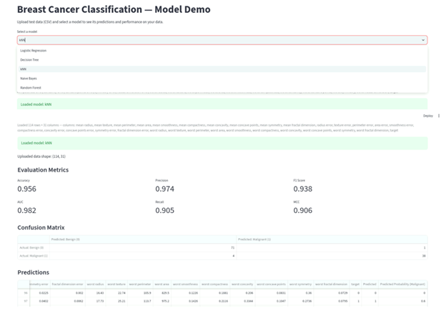

## 2025ac05860-ml-assignment-2 Aim
Learn and implement real-world end-to-end ML deployment workflow: modeling,evaluation, UI design, and deployment.
Implement 5 different classification models (Logistic Regression, Decision Tree Classifier, K-Nearest Neighbor Classifier, Naive Bayes Classifier - Gaussian or Multinomial and Ensemble Model - Random Forest) on a specific dataset and evaluate the performance of the models, Build an interactive Streamlit web application to demonstrate the models

## Choice of dataset
ONE classification dataset of your choice from any public repository - Kaggle or UCI. It may be a binary classification problem or a multi-class
classification problem.

Minimum Feature Size: 12
Minimum Instance Size: 500

## Selected dataset
Breast Cancer Wisconsin (Diagnostic) dataset, (originally from the UCI Machine Learning Repository), but loaded from sklearn.datasets for the purpose of this assignment

## a. Problem Statement

The goal of this assignment is to build and compare multiple binary classification models that predict whether a breast tumor is **malignant** or **benign** based on digitized measurements of the tumor. The models should correctly identifying malignant cases (recall), the underlying target is that a missed malignant diagnosis (false negative) is more costly than a false alarm (false positive).

## b. Dataset Description

- **Source**: Breast Cancer Wisconsin (Diagnostic) dataset, uploaded via `sklearn.datasets.load_breast_cancer()` (originally from the UCI Machine
  Learning Repository).
- **Instances**: 569
- **Features**: 30 numeric features, describing characteristics of cancer cell mass such as radius, texture,   perimeter, area, smoothness, compactness, concavity, symmetry, and fractal dimension (each reported as mean, standard error, and "worst"/largest value).
- **Target**: Binary — malignant vs. benign.
  - **Note on label choice**: scikit-learn's default encoding maps 0 = malignant, 1 = benign. For this assignment, labels were **flipped** so that
    **1 = malignant (positive class)** and **0 = benign (negative class)**, so that we use the traditional check where the "positive" class is the class of interest. All precision/recall/F1/MCC figures below are based on flipped encoding.
- **Class balance**: 212 malignant (37.3%) / 357 benign (62.7%) 
- **Missing values**: none.
- **Train/test split**: 80/20, stratified on the target to preserve class balance in both sets.

## c. GitHub Repository Link

[https://github.com/roopa-r-yavagal/RRY-ml-assignment-2-breast-cancer](https://github.com/roopa-r-yavagal/RRY-ml-assignment-2-breast-cancer)

## d. Models Used

1. Logistic Regression
2. Decision Tree Classifier
3. K-Nearest Neighbor Classifier
4. Naive Bayes Classifier - Gaussian or Multinomial
5. Ensemble Model - Random Forest

### Comparison Table

| ML Model Name | Accuracy | AUC | Precision | Recall | F1 | MCC |
|---|---|---|---|---|---|---|
| Logistic Regression | 0.9649 | 0.9960 | 0.9750 | 0.9286 | 0.9512 | 0.9245 |
| Decision Tree | 0.9298 | 0.9246 | 0.9048 | 0.9048 | 0.9048 | 0.8492 |
| kNN | 0.9561 | 0.9823 | 0.9744 | 0.9048 | 0.9383 | 0.9058 |
| Naive Bayes | 0.9211 | 0.9891 | 0.9231 | 0.8571 | 0.8889 | 0.8292 |
| Random Forest (Ensemble) | 0.9737 | 0.9929 | 1.0000 | 0.9286 | 0.9630 | 0.9442 |

### Observations

### Pre processing

### Feature Scaling
The data sets have a wide variation in magnitude (mean area is in the hundreds, while mean smoothness is a small decimal between 0.05 and 0.15) Logistic regression would have issues with with convergence being slow or not converging, and kNN would be biased towards the larger distance and not the feature correctness. To avoid the above issues, the dataset has been scaled using StandardScaler. 

### Flipped 
scikit-learn's default encoding maps 0 = malignant, 1 = benign. For this assignment, labels were **flipped** so that **1 = malignant (positive class)** and **0 = benign (negative class)**, so that we use the traditional check where the "positive" class is the class of interest. All precision/recall/F1/MCC figures are based on flipped encoding.

| ML Model Name | Observation about model performance |
|---|---|
| Logistic Regression | Given the strong correlation between the feature and the target, linear decision boundaries are well defined. All metrics show a high level of performance. Accuracy and MCC are (Accuracy 0.965, MCC 0.925) very close, indicating the class imbalance is not distorting its reported performance. To be noted - data has been scaled to avoid coversion issues |
| Decision Tree | HAs the lowest score overall (lowest AUC 0.925, lowest MCC 0.849). This aligns with the fact that a single decision tree tends to overfit — it fits the training data very accurately, and performs poorly in generalizing on the test data (low bias, high variance). |
| kNN | Has Accuracy 0.956, MCC 0.906, very close to Logistic Regression. Since kNN uses distance calculations between points, we have used scaling (StandardScaler) on the data set to ensure that the distances are comparable  |
| Naive Bayes | Lowest recall (0.857) — missed 6 malignant cases (6 false negatives), this is a genuine concern for a diagnostic use case. This data set has features that are closly related (e.g. radius, perimeter, area), the independence assumption (treating all 30 features as uncorrelated) is the most likely cause of this poor performance.Its AUC (0.989) is still high — so it ranks cases well in terms of relative risk, but its default 0.5 decision threshold is not the correct choice for this data. |
| Random Forest (Ensemble) | Highest overall performance (Accuracy 0.974, MCC 0.944, perfect precision of 1.0 — zero false positives). As an ensemble, it reduces the variance/overfitting problem seen in the single Decision Tree by averaging predictions across many trees, each trained on a sample of the data with a random subset of features considered at each split. This cancels out noise while reinforcing genuine signal. |
| Overall winner for the dataset | Random Forest — highest accuracy, highest MCC, highest precision, and recall among the models. Its 100% precision (no false positives) and strong recall (0.929, missing only 3 of 42 malignant test cases) makes it the most reliable model for this dataset. |

## Overall
Random Forest — highest accuracy, highest MCC, highest precision, and recall among the models. Its 100% precision (no false positives) and strong recall (0.929, missing only 3 of 42 malignant test cases) makes it the most reliable model for this dataset.

## General observation about the high accuracy of all the models
It is to be notes that all five models achieved consistently high performance (Accuracy: 0.92–0.97, MCC: 0.83–0.94) across fundamentally different algorithm types — linear (Logistic Regression), distance-based (kNN), tree-based (Decision Tree), probabilistic (Naive Bayes), and ensemble (Random Forest). 

This is largely due to the dataset and not the modeling choices. The Breast Cancer Wisconsin dataset, is a small, clean, pre-labeled dataset. The 30 features are well-separated, linear values between malignant and benign classes. Real life datasets would not usually produce uniformly high results across five different and unrelated algorithms. The slight improvement in Random Forest's (Accuracy 0.974, MCC 0.944) is a limited improvement on an already easy classification task. 

## e. Streamlit App

[Streamlit application link] https://rry-ml-assignment-2-breast-cancer-aix7yieippt2gd6k6k2os8.streamlit.app/

## f. Screenshot

### Run streamlit

### Logistic Regression

### Decision Tree

### kNN

### Naive Bayes

### Random Forest

